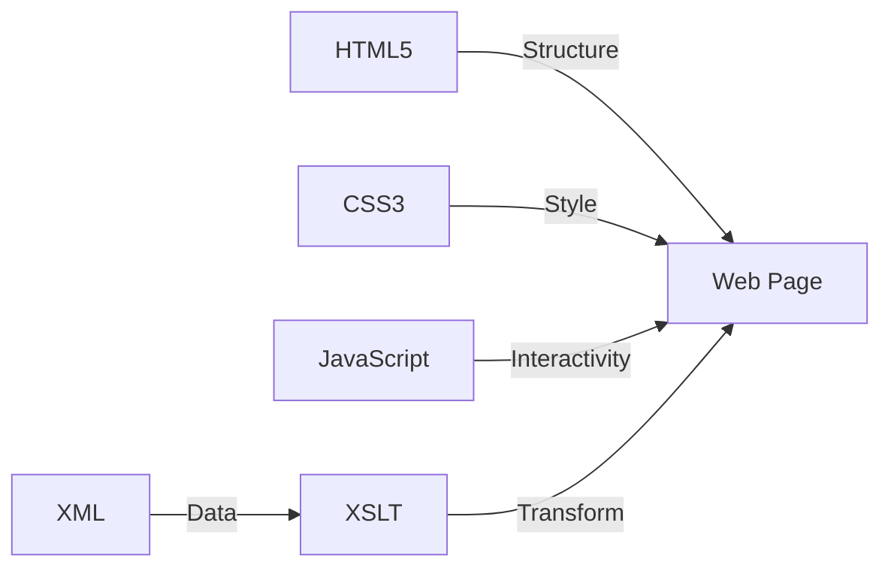

<div align="center">

# 🚀 WEB TECHNOLOGY COURSE


### 🎓 D.Y. Patil College of Engineering & Technology
*An Autonomous Institute*  
📍 Kasaba Bawada, Kolhapur-416006

```
┌─────────────────────────────────────────────────────┐
│  Department of Computer Science & Engineering      │
│  Second Year B.Tech. Curriculum                     │
│  Semester-III & IV • Academic Year: 2024-25        │
└─────────────────────────────────────────────────────┘
```

<p align="center">
  
  
  
  
  
</p>

<p align="center">
  
  
  
  
</p>

</div>

<br/>

<!-- ============================================ -->
<!--        🌐 ASSIGNMENT PORTFOLIO WEBSITE       -->
<!-- ============================================ -->

<div align="center">

## 🌐 VIEW ALL ASSIGNMENTS ONLINE

<br/>

<table>
<tr>
<td align="center">


<br/><br/>

### 🎯 **LIVE ASSIGNMENT PORTFOLIO**

<br/>

```
┏━━━━━━━━━━━━━━━━━━━━━━━━━━━━━━━━━━━━━━━━━━━━━━━━┓
┃                                                  ┃
┃     🚀 Check out all my assignments live!       ┃
┃                                                  ┃
┗━━━━━━━━━━━━━━━━━━━━━━━━━━━━━━━━━━━━━━━━━━━━━━━━┛
```

<br/>

<a href="https://webdevelopment-portfolio-eta.vercel.app/">
  
</a>

<br/><br/>

<a href="YOUR_WEBSITE_URL_HERE">
  
  
  
</a>

<br/><br/>

### 📂 **What's Inside?**

| ✨ Feature | 📝 Description |
|-----------|---------------|
| 🎨 **Live Demos** | Interactive preview of all assignments |
| 📱 **Responsive Design** | Works on all devices |
| 💻 **Source Code** | View and download code |
| 🔍 **Search & Filter** | Find assignments quickly |
| 📊 **Progress Tracker** | See completion status |

<br/>

> 💡 **Tip:** Bookmark this page to quickly access all your web technology assignments!

</td>
</tr>
</table>

</div>

<br/>

<div align="center">

### 🌟 Transform Your Ideas Into Interactive Web Applications 🌟

</div>

<br/>

<div align="center">

## 🗂️ TABLE OF CONTENTS

</div>

<table align="center">
<tr>
<td>

**📌 QUICK NAVIGATION**

- 🌐 [**Assignment Portfolio Website**](#-view-all-assignments-online) ⭐
- 🎯 [Course Overview](#-course-overview)
- 🧪 [Lab Assignments](#-lab-assignments)
- 📚 [Learning Resources](#-learning-resources)
- 🚀 [Getting Started](#-getting-started)
- 💡 [Tips for Success](#-tips-for-success)

</td>
</tr>
</table>

<br/>

<div align="center">

## 🎯 COURSE OVERVIEW


</div>

<table>
<tr>
<td>

### 📖 What You'll Learn

This **comprehensive Web Technology course** is designed to transform you from a beginner to a confident web developer. You'll master the foundational technologies that power the modern web.

</td>
</tr>
</table>

<div align="center">

### 🎯 LEARNING OBJECTIVES

</div>

<table>
<tr>
<td width="50%">

#### 🏗️ **Frontend Mastery**
- ✨ Master HTML5 structure & semantics
- 🎨 Create stunning designs with CSS3
- 📱 Build responsive web layouts
- 🖼️ Implement modern web elements

</td>
<td width="50%">

#### 🔧 **Data & Transformation**
- 📋 Learn XML data representation
- 🔄 Implement XSLT transformations
- 🗺️ Navigate with XPath expressions
- 💼 Develop practical applications

</td>
</tr>
</table>

<div align="center">

### 🌈 TECHNOLOGY STACK



</div>

<br/>

<div align="center">

## 🧪 LAB ASSIGNMENTS


</div>

<br/>

### 🎨 **HTML & Web Fundamentals** 

<table>
<tr>
<th>📝 Assignment</th>
<th>⏱️ Hours</th>
<th>🏷️ Type</th>
</tr>
<tr>
<td><b>1.</b> Study of Web Technology basics along with different web technology languages</td>
<td align="center">2</td>
<td align="center"><code>O</code></td>
</tr>
<tr>
<td><b>2.</b> Create static web pages by using HTML tags</td>
<td align="center">2</td>
<td align="center"><code>O</code></td>
</tr>
<tr>
<td><b>3.</b> Create a web page which defines all text formatting tags</td>
<td align="center">2</td>
<td align="center"><code>O</code></td>
</tr>
<tr>
<td><b>4.</b> Create a webpage using list tags of HTML</td>
<td align="center">2</td>
<td align="center"><code>O</code></td>
</tr>
<tr>
<td><b>5.</b> Create webpage to include image using HTML tag</td>
<td align="center">2</td>
<td align="center"><code>O</code></td>
</tr>
<tr>
<td><b>6.</b> Create webpage to include frames using HTML tag</td>
<td align="center">2</td>
<td align="center"><code>O</code></td>
</tr>
<tr>
<td><b>7.</b> Demonstrate the use of link tags in HTML</td>
<td align="center">2</td>
<td align="center"><code>O</code></td>
</tr>
<tr>
<td><b>8.</b> Demonstrate the use of list tags in HTML</td>
<td align="center">2</td>
<td align="center"><code>O</code></td>
</tr>
</table>

<br/>

### 📋 **Forms & Interactive Elements**

<table>
<tr>
<th>📝 Assignment</th>
<th>⏱️ Hours</th>
<th>🏷️ Type</th>
</tr>
<tr>
<td><b>9.</b> Create employee registration webpage using HTML form objects</td>
<td align="center">2</td>
<td align="center"><code>O</code></td>
</tr>
<tr>
<td><b>10.</b> Create resume as webpage using HTML tags</td>
<td align="center">2</td>
<td align="center"><code>O</code></td>
</tr>
</table>

<br/>

### 🔄 **XML & Transformations**

<table>
<tr>
<th>📝 Assignment</th>
<th>⏱️ Hours</th>
<th>🏷️ Type</th>
</tr>
<tr>
<td><b>11.</b> Study and implementation of XML</td>
<td align="center">2</td>
<td align="center"><code>S</code></td>
</tr>
<tr>
<td><b>12.</b> Implementation of XSLT to transform XML to XSLT</td>
<td align="center">2</td>
<td align="center"><code>O</code></td>
</tr>
<tr>
<td><b>13.</b> Implementation of student application using XSLT and conditional statement</td>
<td align="center">2</td>
<td align="center"><code>O</code></td>
</tr>
</table>

<br/>

<div align="center">

### 📊 Assignment Distribution

```
┌─────────────────────────────────────────┐
│  📌 Total Assignments: 13               │
│  ⚡ Operational (O): 12                 │
│  📚 Study (S): 1                        │
│  ⏰ Total Lab Hours: 26                 │
└─────────────────────────────────────────┘
```

</div>

<br/>

<div align="center">

## 📚 LEARNING RESOURCES


</div>

<br/>

<table>
<tr>
<td>

### 📕 TEXT BOOKS

<br/>

#### 📖 **Book 1: Pro HTML5 and CSS3 Design Patterns**
```
👥 Authors: Michael Bowers, Dionysios Synodinos, Victor Sumner
📚 Edition: A press edition
⭐ Focus: Modern design patterns and best practices
```

<br/>

#### 📖 **Book 2: A Smarter Way to Learn HTML and CSS**
```
👤 Author: Mark Myers
📚 Additional: XML in a Nutshell by Elliotte Rusty Harold, W. Scott Means
🏢 Publisher: O'Reilly Publication, 3rd Edition
⭐ Focus: Interactive learning approach
```

</td>
</tr>
</table>

<br/>

<table>
<tr>
<td>

### 📗 REFERENCE BOOKS

<br/>

| # | Title | Author | Publisher |
|---|-------|--------|-----------|
| 1️⃣ | **Web Development with Node and Express** | Ethan Brown | O'Reilly Media |
| 2️⃣ | **HTML, CSS, and JavaScript: All in One** | Jennifer Kyrnin & JuliMeloni | Pearson Publication |
| 3️⃣ | **XML Technologies** | Atul Kahate (3rd Edition) | — |

</td>
</tr>
</table>

<br/>

<div align="center">

### 🌐 ONLINE RESOURCES

</div>

<p align="center">
  <a href="https://www.javascript.com/">
    
  </a>
  <a href="https://www.w3schools.com/">
    
  </a>
</p>

<table align="center">
<tr>
<td align="center" width="50%">

🔗 **[JavaScript.com](https://www.javascript.com/)**  
Interactive JavaScript tutorials and playground

</td>
<td align="center" width="50%">

🔗 **[W3Schools.com](https://www.w3schools.com/)**  
Comprehensive web development references

</td>
</tr>
</table>

<br/>

<div align="center">

## 🚀 GETTING STARTED


</div>

<br/>

### 🛠️ **PREREQUISITES**

<table>
<tr>
<td width="25%" align="center">

💻  
**Computer**  
Basic literacy

</td>
<td width="25%" align="center">

📝  
**Text Editor**  
VS Code/Sublime

</td>
<td width="25%" align="center">

🌐  
**Browser**  
Chrome/Firefox

</td>
<td width="25%" align="center">

🔥  
**Enthusiasm**  
Ready to learn!

</td>
</tr>
</table>

<br/>

### 📥 **SETUP YOUR ENVIRONMENT**

<table>
<tr>
<td>

#### Step 1: Install Code Editor

```bash
# 🎨 Recommended: Visual Studio Code
# Download from: https://code.visualstudio.com/
```

**Popular Extensions:**
- ✨ Live Server
- 🎨 Prettier - Code formatter
- 🔍 HTML CSS Support
- 🌈 Bracket Pair Colorizer

</td>
</tr>
</table>

<br/>

<table>
<tr>
<td>

#### Step 2: Install Web Browsers

```
✅ Chrome    → Primary development & debugging
✅ Firefox   → Cross-browser testing
✅ Edge      → Additional compatibility testing
```

**Essential Browser Tools:**
- 🔧 Developer Tools (F12)
- 📱 Responsive Design Mode
- 🐛 Console for debugging

</td>
</tr>
</table>

<br/>

<table>
<tr>
<td>

#### Step 3: Create Project Structure

```bash
# 📁 Create your workspace
mkdir web-technology-course
cd web-technology-course

# 📂 Organize your files
mkdir html css xml assignments projects
```

**Recommended Structure:**
```
web-technology-course/
├── 📄 html/
│   ├── assignment1.html
│   └── assignment2.html
├── 🎨 css/
│   └── styles.css
├── 📋 xml/
│   └── data.xml
├── 🧪 assignments/
└── 🚀 projects/
```

</td>
</tr>
</table>

<br/>

<table>
<tr>
<td>

#### Step 4: Your First Web Page

Create `index.html` and paste this code:

```html
<!DOCTYPE html>
<html>
<head>
    <title>Assignment 2 - Static Web Page</title>
</head>
<body>
    <h1>Hey, I'm a Web Dev Student!</h1>
    
    <h2>About Me</h2>
    <p>I'm [Your Name], studying Computer Science at D.Y. Patil College. Learning HTML is actually pretty fun!</p>
    
    <h2>My Hobbies</h2>
    <p>I love watching tech videos, playing games, and trying new food places around Kolhapur.</p>
    
    <h2>My Goal</h2>
    <p>Want to build my own portfolio website by the end of this semester. Wish me luck!</p>
    
    <hr>
    
    <p><b>Student:</b> [Your Name]</p>
    <p><b>Roll No:</b> [Your Roll Number]</p>
</body>
</html>
```

**🎯 Open it in your browser and see the magic!**

</td>
</tr>
</table>

<br/>

<div align="center">

## 💡 TIPS FOR SUCCESS


</div>

<br/>

<table>
<tr>
<td width="33%">

### 🎯 **Practice Daily**

```
⏰ Code every day
🔄 Repetition builds skill
🌱 Start small, grow big
```

Regular practice is the key to mastering web development. Even 30 minutes daily makes a huge difference!

</td>
<td width="33%">

### 🔬 **Experiment Freely**

```
🎨 Try new styles
🧪 Break things
🔧 Fix them
```

Don't be afraid to experiment! The best way to learn is by trying different approaches and seeing what works.

</td>
<td width="33%">

### 🚀 **Build Projects**

```
💼 Real-world apps
🎨 Portfolio pieces
🌟 Showcase skills
```

Apply your knowledge by building actual projects. This reinforces learning and builds your portfolio.

</td>
</tr>
</table>

<br/>

<table>
<tr>
<td width="33%">

### 👥 **Collaborate**

```
🤝 Work with peers
💬 Share knowledge
🎓 Learn together
```

Join study groups, participate in discussions, and help others. Teaching is the best way to learn!

</td>
<td width="33%">

### 🐛 **Debug Mindfully**

```
🔍 Read error messages
🧠 Think logically
✅ Test solutions
```

Errors are learning opportunities. Take time to understand what went wrong and why.

</td>
<td width="33%">

### 📚 **Use Resources**

```
🌐 Online tutorials
📖 Documentation
🎥 Video courses
```

Leverage the wealth of online resources. W3Schools, MDN, and Stack Overflow are your friends!

</td>
</tr>
</table>

<br/>

<div align="center">

### 🎯 **Pro Developer Habits**

</div>

<table align="center">
<tr>
<td>

| ✅ Do This | ❌ Avoid This |
|-----------|--------------|
| Write clean, readable code | Writing messy, uncommented code |
| Test in multiple browsers | Testing in only one browser |
| Use semantic HTML tags | Using only `<div>` tags |
| Comment your complex code | Leaving no comments |
| Keep learning new techniques | Sticking to old methods only |
| Ask questions when stuck | Struggling alone for hours |
| Backup your code regularly | Risking data loss |
| Validate your HTML/CSS | Ignoring validation errors |

</td>
</tr>
</table>

<br/>

<div align="center">

## 📊 COURSE STATISTICS


</div>

<br/>

<table align="center">
<tr>
<td align="center">

### 🎓
**13**  
Lab Assignments

</td>
<td align="center">

### ⏰
**26**  
Lab Hours

</td>
<td align="center">

### 📚
**15**  
Theory Hours

</td>
<td align="center">

### 🎯
**41**  
Total Hours

</td>
</tr>
</table>

<br/>

<div align="center">

### 🏆 ASSESSMENT PATTERN

</div>

<table align="center">
<tr>
<td align="center" width="50%">

#### 🔷 **Operational Assignments**
```
Type: O
Count: 12
Focus: Practical Implementation
```

</td>
<td align="center" width="50%">

#### 🔶 **Study Assignments**
```
Type: S
Count: 1
Focus: Research & Analysis
```

</td>
</tr>
</table>

<br/>

---

<div align="center">

## 📞 CONTACT INFORMATION


</div>

<br/>

<table align="center">
<tr>
<td align="center">

**D.Y. Patil College of Engineering & Technology**  
Department of Computer Science & Engineering  
📍 Kasaba Bawada, Kolhapur - 416006  
Maharashtra, India 🇮🇳

<br/>

**Head of Department**  
Computer Science & Engineering

</td>
</tr>
</table>

<br/>

---

<br/>

<div align="center">

## 📄 LICENSE & USAGE

<sub>This curriculum is provided by D.Y. Patil College of Engineering & Technology for educational purposes.</sub>

</div>

<br/>

---

<br/>

<div align="center">


<br/><br/>

# 🌟 START YOUR WEB DEVELOPMENT JOURNEY TODAY! 🌟

<br/>

### *"The best way to predict the future is to create it"*

<br/>


<br/><br/>

### 🚀 **Happy Coding!** 🚀

<br/>

<sub>Last Updated: Academic Year 2024-25</sub>

<br/>

---

<br/>


</div>
